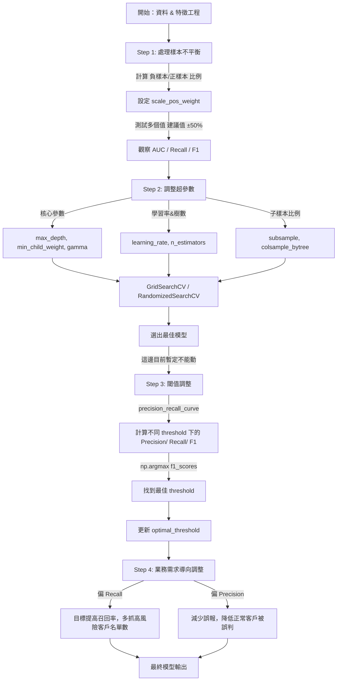

Relation to HAWKEYE_MODEL

```mermaid
flowchart TD
    A[開始：資料 & 特徵工程] --> B[Step 1: 處理樣本不平衡]
    B -->|計算 負樣本/正樣本 比例| C[設定 scale_pos_weight]
    C -->|測試多個值 建議值 ±50%| D[觀察 AUC / Recall / F1]
    
    D --> E[Step 2: 調整超參數]
    E -->|核心參數| F[max_depth, min_child_weight, gamma]
    E -->|學習率&樹數| G[learning_rate, n_estimators]
    E -->|子樣本比例| H[subsample, colsample_bytree]
    F --> I[GridSearchCV / RandomizedSearchCV]
    G --> I
    H --> I
    I --> J[選出最佳模型]
    
    J --> |這邊目前暫定不能動|K[Step 3: 閾值調整 ]
    K -->|precision_recall_curve| L[計算不同 threshold 下的 Precision/ Recall/ F1]
    L -->|np.argmax f1_scores| M[找到最佳 threshold]
    M --> N[更新 optimal_threshold]
    
    N --> O[Step 4: 業務需求導向調整]
    O -->|偏 Recall| P[目標提高召回率，多抓高風險客戶名單數]
    O -->|偏 Precision| Q[減少誤報，降低正常客戶被誤判]
    
    P --> R[最終模型輸出]
    Q --> R
```

